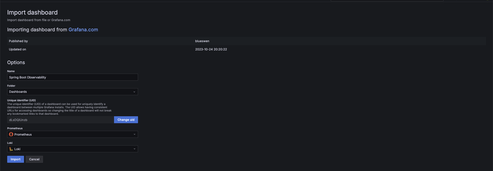

# Observability stack for Spring boot and Oracle database applications

Observability is the mechanism by which state and health of applications deployed in an environment can be measured based on the events/data generated as logs, traces and metrics by the application components. It is also crucial to be able to establish a correlation between these events/data points to get an overall understanding of request processing and isolate the failing/ineffective components/services.

This example provides ready to use configurations for setting up a observability stack using [Prometheus](https://prometheus.io/) for metrics, [OpenTelemetry](https://opentelemetry.io/) and [Jaeger](https://www.jaegertracing.io/) for tracing and [Loki](https://grafana.com/oss/loki/) for logs. [Grafana](https://grafana.com/) is used as the UI tool to navigate and correlate the data generated by the stack.

The `store-manager` is a [Spring Boot](https://spring.io/projects/spring-boot) app that uses an [Oracle Database 23ai](https://www.oracle.com/in/database/free/get-started/) free Instance to store and serve a product catalog.

[Kubernetes](https://kubernetes.io/) is used as the platform to deploy the stack and application as services.

## Getting started

### Kubernetes cluster

Create a Kubernetes cluster with minimum of one worker node having at least 50GB of free space. Any cloud service such as [OKE](https://www.oracle.com/in/cloud/cloud-native/kubernetes-engine/) can be used to create the cluster or alternatively use [kind](https://kind.sigs.k8s.io/docs/user/quick-start/) to create the cluster simply by

```shell
kind create cluster
```

### Install helm and kubectl

Please follow [Installing Helm](https://helm.sh/docs/intro/install/) to install the `helm` tool to deploy Helm Charts.
The `kubectl` cli can be installed using the instructions provided [here](https://kubernetes.io/docs/tasks/tools/).

### Deploy Observabilty stack

Ensure you have access to the cluster by executing

```shell
kubectl get ns
```

Modify `./grafana-secret.yaml` to provide a password for grafana admin user.

```yaml
stringData:
  user: "admin"
  password: "<grafana_admin_password>"
```

Execute following commands to instal the stack using helm.

```shell

kubectl create ns spring-oracledb-observability

helm repo add prometheus-community https://prometheus-community.github.io/helm-charts
helm repo add jaegertracing https://jaegertracing.github.io/helm-charts
helm repo add open-telemetry https://open-telemetry.github.io/opentelemetry-helm-charts
helm repo add grafana https://grafana.github.io/helm-charts

helm repo update

helm -n spring-oracledb-observability install spring-oracledb-observability-prometheus prometheus-community/prometheus -f ./prometheus-values.yaml
helm -n spring-oracledb-observability install spring-oracledb-observability-ksm prometheus-community/kube-state-metrics

helm -n spring-oracledb-observability install spring-oracledb-observability-jaeger jaegertracing/jaeger -f ./jaeger-values.yaml

helm -n spring-oracledb-observability install spring-oracledb-observability-otel open-telemetry/opentelemetry-collector -f ./otel-values.yaml

kubectl -n spring-oracledb-observability apply -f ./grafana-secret.yaml
helm -n spring-oracledb-observability install spring-oracledb-observability-grafana grafana/grafana -f grafana-values.yaml
helm -n spring-oracledb-observability install spring-oracledb-observability-loki grafana/loki -f loki-values.yaml
helm -n spring-oracledb-observability install spring-oracledb-observability-promtail grafana/promtail -f promtail-values.yaml

```

Have a peek at the `spring-oracledb-observability` namespace to see all pods are up and running.

```shell
bash-3.2$ kubectl -n spring-oracledb-observability get pods
NAME                                                              READY   STATUS      RESTARTS      AGE
loki-canary-2th5g                                                 1/1     Running     0             66m
spring-oracledb-observability-grafana-56d46f4bcb-s5v58            1/1     Running     0             51m
spring-oracledb-observability-jaeger-agent-htnhr                  1/1     Running     0             43m
spring-oracledb-observability-jaeger-cassandra-0                  1/1     Running     0             42m
spring-oracledb-observability-jaeger-cassandra-1                  1/1     Running     0             41m
spring-oracledb-observability-jaeger-cassandra-2                  1/1     Running     0             39m
spring-oracledb-observability-jaeger-cassandra-schema-5mxbf       0/1     Completed   1             43m
spring-oracledb-observability-jaeger-collector-699c4c894f-h55wl   1/1     Running     5 (41m ago)   43m
spring-oracledb-observability-jaeger-query-746857ccb9-zk9x9       2/2     Running     5 (41m ago)   43m
spring-oracledb-observability-ksm-kube-state-metrics-596b95sq7f   1/1     Running     0             163m
spring-oracledb-observability-loki-0                              2/2     Running     0             66m
spring-oracledb-observability-loki-chunks-cache-0                 2/2     Running     0             66m
spring-oracledb-observability-loki-gateway-66d5596c67-qw4b7       1/1     Running     0             66m
spring-oracledb-observability-loki-minio-0                        1/1     Running     0             66m
spring-oracledb-observability-loki-results-cache-0                2/2     Running     0             66m
spring-oracledb-observability-otel-opentelemetry-collectorjmvxv   1/1     Running     0             42m
spring-oracledb-observability-prometheus-kube-state-metricvs6lp   1/1     Running     0             61s
spring-oracledb-observability-prometheus-prometheus-node-ecqr6k   1/1     Running     0             61s
spring-oracledb-observability-prometheus-prometheus-pushgaqst4n   1/1     Running     0             61s
spring-oracledb-observability-prometheus-server-6d4864c9884vlgh   2/2     Running     0             61s
spring-oracledb-observability-promtail-c26pb                      1/1     Running     0             149m

```

### Deploy Oracle Database Operator

The Oracle database instance will be created using the [Oracle Database Operator](https://github.com/oracle/oracle-database-operator). In order to use the Oracle Database Operator, we must first install the [cert-manager](https://github.com/cert-manager/cert-manager).

```shell
kubectl apply -f https://github.com/cert-manager/cert-manager/releases/download/v1.14.4/cert-manager.yaml
```

Once all the pods in `cert-manager` namespace are up and running, install the operator.

```shell
kubectl apply -f https://raw.githubusercontent.com/oracle/oracle-database-operator/refs/heads/main/rbac/cluster-role-binding.yaml
kubectl apply -f https://raw.githubusercontent.com/oracle/oracle-database-operator/refs/heads/main/oracle-database-operator.yaml
```

Wait for the operator pods to be ready.

```shell
bash-3.2$ kubectl -n oracle-database-operator-system get pods
NAME                                                           READY   STATUS    RESTARTS   AGE
oracle-database-operator-controller-manager-7f84b7dc4b-gpwr2   1/1     Running   0          141m
oracle-database-operator-controller-manager-7f84b7dc4b-m986d   1/1     Running   0          141m
oracle-database-operator-controller-manager-7f84b7dc4b-v7rzw   1/1     Running   0          141m
```

### Create Oracle Database 23ai free instance

Edit the `freedb.yaml` file and provide the passwords that you want to use for the admin and application user for the database.

```yaml
stringData:
  ## Specify your DB password here
  ## spring_pasword should be same as password specified in store-manager/src/main/resources/db/changelog/user.sql
  oracle_pwd: "<enter_sysadmin_password>"
  spring_user: "store"
  spring_pasword: "<enter_application_user_password>"
  liquibase_user: "SYS AS SYSDBA"
```

Please note that the application uses [Liquibase](https://contribute.liquibase.com/extensions-integrations/directory/integration-docs/springboot/) for creating the application user, tables and loading data into tables at application startup. Therefore you will need to provide the application user password in `store-manager/src/main/resources/db/changelog/user.sql` file too.

```sql
create user store identified by "<enter_application_user_password>";
```

After making these changes, execute

```shell
kubectl apply -f ./freedb.yaml
```

Wait till the db is up and running.

```shell
bash-3.2$ kubectl get pods
NAME                             READY   STATUS    RESTARTS   AGE
freedb-sample-t4s6t              1/1     Running   0          164m
```

### Create and push application container image

You can use [build-image](https://docs.spring.io/spring-boot/maven-plugin/build-image.html) maven plugin to create a docker image for the application and then you can push it to a registry such as [ghcr.io](https://docs.github.com/en/packages/learn-github-packages/introduction-to-github-packages) or a hosted registry such as [OCI Container Registry](https://www.oracle.com/in/cloud/cloud-native/container-registry/).

```shell
export IMAGE="<repo:tag>"
cd store-manager
mvn spring-boot:build-image -Dspring-boot.build-image.imagePlatform=linux/amd64 -Dspring-boot.build-image.imageName="$IMAGE" -Dspring-boot.build-image.cleanCache=true
podman push "$IMAGE"
```

### Deploy the application

Edit `./deploy.yaml` and replace `ghcr.io/lake-of-dreams/spring-oracledb-observability-store-manager:0.0.1-SNAPSHOT` with the `IMAGE` from previous step.

Wait till the application is up and running.

```shell
bash-3.2$ kubectl get pods
NAME                             READY   STATUS    RESTARTS   AGE
freedb-sample-t4s6t              1/1     Running   0          165m
store-manager-7d7cd5987d-dwtmd   1/1     Running   0          91m
```

### Test the service

In a separate terminal window, execute

```shell
kubectl port-forward svc/store-manager 8080:8080
```

Now test the service by executing few api requests in a separate terminale

```shell
curl -kv http://localhost:8080/api/v1/products
curl -kv http://localhost:8080/api/v1/products/1
curl -kv http://localhost:8080/api/v1/products/23193
```

### Access Grafana to see observability data

In a separate terminal window, execute

```shell
kubectl -n spring-oracledb-observability port-forward svc/spring-oracledb-observability-grafana 8000:80
```

and access grafana at http://localhost:8000/ using the credentials provided in `./grafana-secret.yaml` . Navigate to http://localhost:8000/dashboards and click on  and click `Import` to import the (Spring Boot Observability dashboard)(https://grafana.com/grafana/dashboards/17175-spring-boot-observability/ ) using its id `17175`.

.

Click on `/api/v1/products/{productId}` in the `Request Per Sec` panel and select an diamond shaped [exemplar](https://grafana.com/docs/grafana/latest/fundamentals/exemplars/) for one of the requests.

Click on the `Query With Jaeger` button.

.

In the resulting screen, you will be able to see the traces corresponding to the request. You can expand a span and click `Logs for this span` to access logs related to this request invocation from Loki.

.

Click on the link symbol for a span in the Jaeger view to access the menu for options to see `Latency` and `Througput` related metrics graphs.

.

For example, the latency graph will look similar to the one below:


